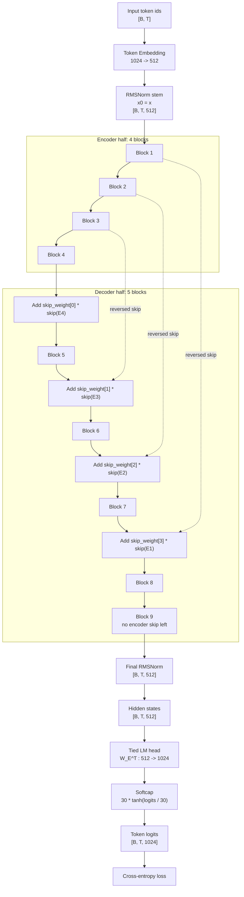
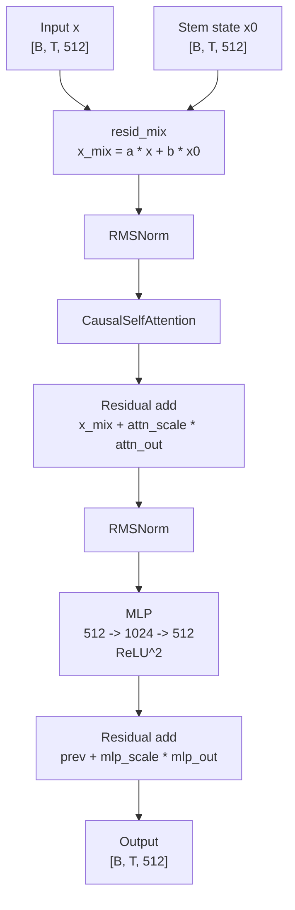
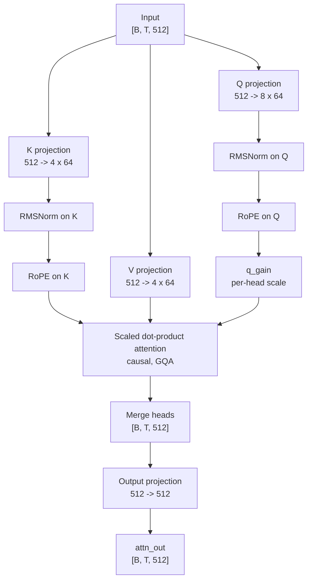

# Model Architecture

This document describes the shared model architecture used by [train_gpt_mlx.py](/Users/jeebho01/parameter-golf/train_gpt_mlx.py) and [train_gpt.py](/Users/jeebho01/parameter-golf/train_gpt.py).

## Architecture Summary

- Model family: autoregressive causal LM with a split encoder/decoder-style transformer trunk rather than a plain linear decoder stack.
- Default shape: `vocab_size=1024`, `d_model=512`, `num_layers=9`, `num_heads=8`, `num_kv_heads=4`, `head_dim=64`, `mlp_hidden=1024`, `rope_base=10000`.
- Stem: token embedding only, then RMSNorm; there is no learned positional embedding.
- Core trunk: 4 encoder blocks store skips, then 5 decoder blocks consume those skips in reverse order with learned per-channel `skip_weights`.
- Each block first mixes the current state with the original stem state `x0` through a learned 2-way per-channel `resid_mix`, then applies pre-norm attention and pre-norm MLP residual updates.
- Attention is GQA: `Q` has 8 heads, `K/V` have 4 heads, with RMSNorm on `Q/K`, RoPE on `Q/K`, and a learned per-head `q_gain`.
- Output head: final RMSNorm, then tied embedding projection to logits plus tanh softcap (`c=30`) before cross-entropy in both implementations.

## Assumptions

- This document treats the tied LM head as part of the full architecture even though [train_gpt_mlx.py](/Users/jeebho01/parameter-golf/train_gpt_mlx.py) returns hidden states from `__call__` and applies the logits plus loss path separately in `loss()`.
- The MLX and PyTorch implementations match architecturally; the PyTorch file is used here only to confirm the same output-head structure.

## Whole Network

## Block Diagrams

### Transformer Block

### Causal Self-Attention

## Implementation Spec

| Block | Order | Key parameters | Input shape | Output shape | Notes |
| --- | --- | --- | --- | --- | --- |
| Token embedding + stem norm | 1 | `vocab=1024`, `d_model=512` | `[B,T]` | `[B,T,512]` | Stem output is also saved as `x0` and reused by every block. |
| Encoder stack | 2 | `4 x Block` | `[B,T,512]` | `[B,T,512]` | Outputs of all 4 encoder blocks are pushed onto a skip stack. |
| Transformer block | repeated | `resid_mix`, `attn_scale`, `mlp_scale` are per-channel vectors of size `512` | `[B,T,512]`, `x0` | `[B,T,512]` | Pre-norm attention and pre-norm MLP, both residual. |
| Attention sublayer | inside block | `8` query heads, `4` KV heads, `head_dim=64`, RoPE, learned `q_gain` | `[B,T,512]` | `[B,T,512]` | GQA causal attention with RMSNorm on `Q` and `K` before RoPE. |
| MLP sublayer | inside block | `512 -> 1024 -> 512`, `mlp_mult=2` | `[B,T,512]` | `[B,T,512]` | Activation is `ReLU^2`, not GELU/SiLU. |
| Decoder stack | 3 | `5 x Block` | `[B,T,512]` | `[B,T,512]` | First 4 decoder blocks each add one reversed encoder skip via learned `skip_weights`; last decoder block has no skip input. |
| Final norm | 4 | RMSNorm | `[B,T,512]` | `[B,T,512]` | Returned directly by MLX `__call__`. |
| LM head | 5 | tied embedding projection `W_E^T`, softcap `c=30` | `[B,T,512]` | `[B,T,1024]` | In MLX this lives in `loss()`; in PyTorch it is part of `forward()`. |

## Code Anchors

- Hyperparameters and default model shape: [train_gpt_mlx.py:39](/Users/jeebho01/parameter-golf/train_gpt_mlx.py#L39)
- MLX attention block: [train_gpt_mlx.py:291](/Users/jeebho01/parameter-golf/train_gpt_mlx.py#L291)
- MLX transformer block: [train_gpt_mlx.py:350](/Users/jeebho01/parameter-golf/train_gpt_mlx.py#L350)
- MLX GPT trunk and skip flow: [train_gpt_mlx.py:378](/Users/jeebho01/parameter-golf/train_gpt_mlx.py#L378)
- MLX logits and loss path: [train_gpt_mlx.py:431](/Users/jeebho01/parameter-golf/train_gpt_mlx.py#L431)
- PyTorch attention block: [train_gpt.py:555](/Users/jeebho01/parameter-golf/train_gpt.py#L555)
- PyTorch GPT forward and tied head: [train_gpt.py:648](/Users/jeebho01/parameter-golf/train_gpt.py#L648)
